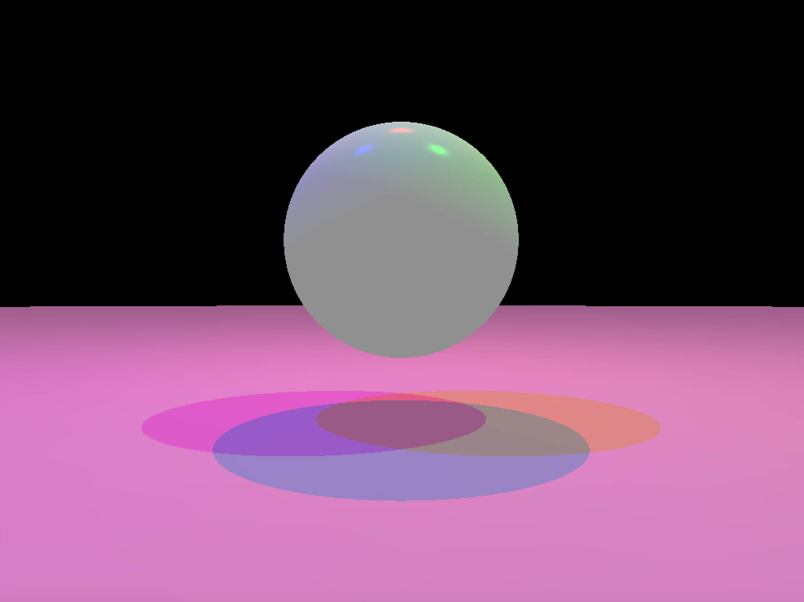

# 🖼️ miniRT

`miniRT` is a minimal ray tracer developed as part of the 42 curriculum. It renders 3D scenes by simulating the way light interacts with geometric objects, following the fundamentals of ray tracing. The project supports basic shapes (cylinder, sphere, plane), lighting, and camera functionality.

---

## 🛠️ Features

- ✅ **Scene parsing** from `.rt` files  
- 📷 **Camera** with configurable field of view and transformations  
- ☀️ **Ambient and point lighting**
- 🔺 **Basic geometric primitives:**
  - Spheres
  - Planes
  - Cylinders
- 🌈 **RGB color support**
- 🧮 **Vector and matrix operations**
- 🧪 **Ray-object intersection calculations**

---

## 📦 How to Use

### 🔧 Build the project
To compile the ray tracer without bonus:

```bash
make
```

To compile the ray tracer with bonus:

```bash
make bonus
```

### ▶️ Run the program

```bash
./minirt ./maps/H2O.rt
```

```bash
./minirt_bonus ./maps/bonus/multi_lights.rt
```



```bash
./minirt_bonus ./maps/big_room.rt
```

